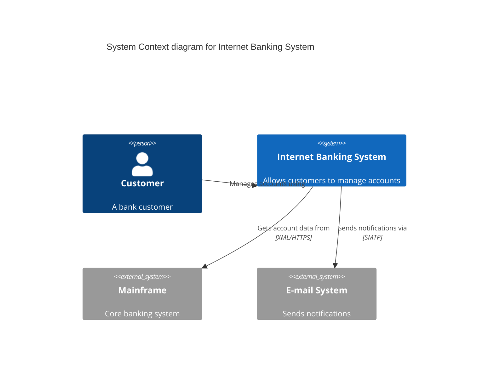
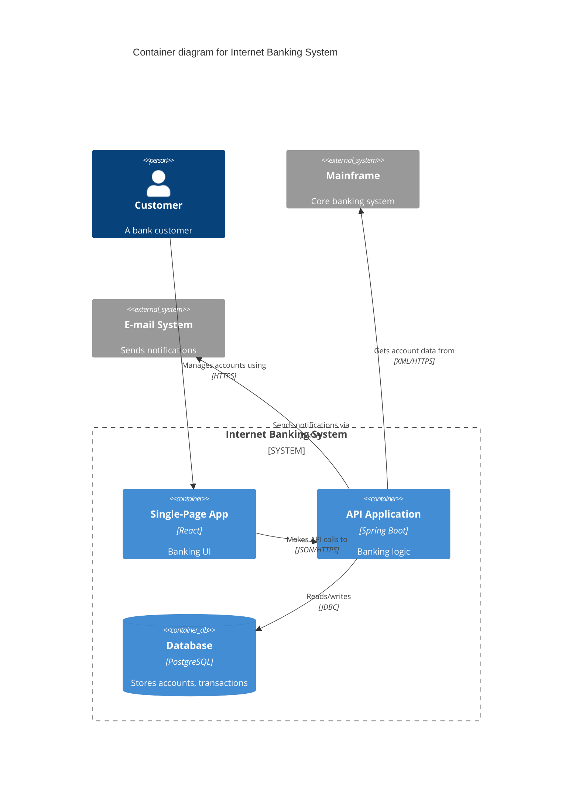
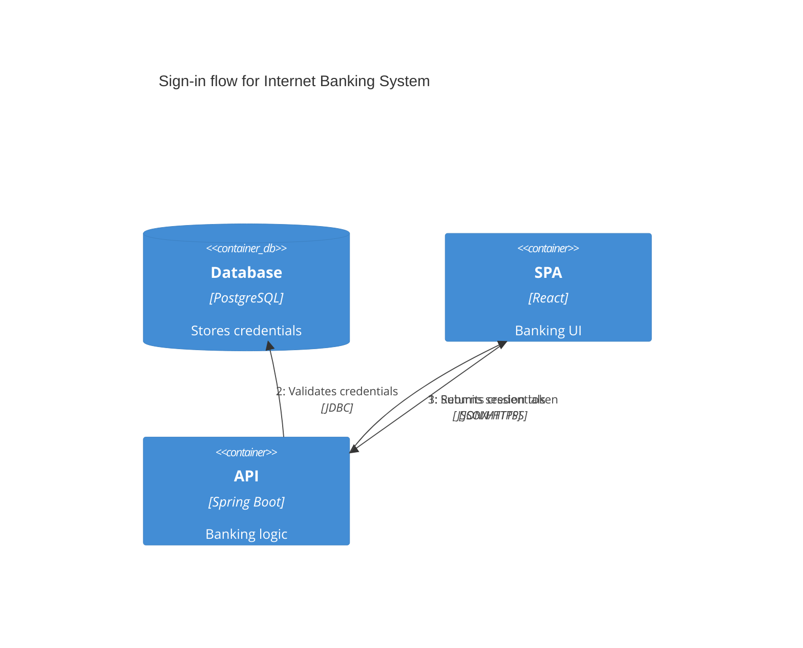
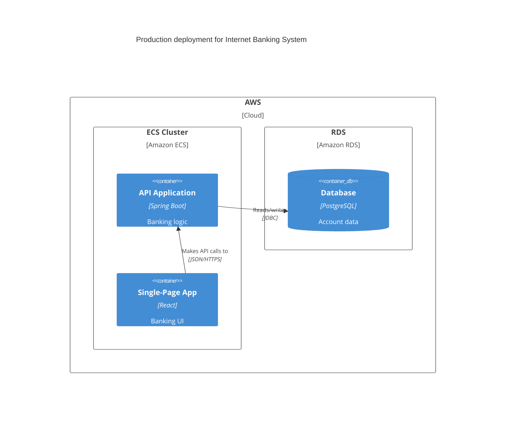

# Mermaid C4 Diagrams

Renders natively in GitHub, GitLab, and many markdown tools. Mermaid's C4 support is experimental but functional.

These illustrate the syntax. Consider what fits your context.

## Diagram Types

Each C4 diagram level has its own Mermaid diagram type:

- `C4Context` — System Context diagrams
- `C4Container` — Container diagrams
- `C4Component` — Component diagrams
- `C4Dynamic` — Dynamic diagrams
- `C4Deployment` — Deployment diagrams

## Elements

### People

```
Person(alias, "Label", "Description")
Person_Ext(alias, "Label", "Description")
```

### Software Systems

```
System(alias, "Label", "Description")
System_Ext(alias, "Label", "Description")
SystemDb(alias, "Label", "Description")
SystemQueue(alias, "Label", "Description")
SystemDb_Ext(alias, "Label", "Description")
SystemQueue_Ext(alias, "Label", "Description")
```

### Containers

```
Container(alias, "Label", "Technology", "Description")
Container_Ext(alias, "Label", "Technology", "Description")
ContainerDb(alias, "Label", "Technology", "Description")
ContainerQueue(alias, "Label", "Technology", "Description")
ContainerDb_Ext(alias, "Label", "Technology", "Description")
ContainerQueue_Ext(alias, "Label", "Technology", "Description")
```

### Components

```
Component(alias, "Label", "Technology", "Description")
Component_Ext(alias, "Label", "Technology", "Description")
ComponentDb(alias, "Label", "Technology", "Description")
ComponentQueue(alias, "Label", "Technology", "Description")
```

### Deployment Nodes

```
Deployment_Node(alias, "Label", "Type", "Description")
Node(alias, "Label", "Type", "Description")
Node_L(alias, "Label", "Type", "Description")
Node_R(alias, "Label", "Type", "Description")
```

## Boundaries

Group elements visually:

```
Boundary(alias, "Label", "Type")
Enterprise_Boundary(alias, "Label")
System_Boundary(alias, "Label")
Container_Boundary(alias, "Label")
```

Boundaries use block syntax — elements inside the boundary go between the boundary declaration and a closing `}`:

```
System_Boundary(b1, "Internet Banking System") {
    Container(spa, "SPA", "React", "Banking UI")
    Container(api, "API", "Spring Boot", "Banking logic")
    ContainerDb(db, "Database", "PostgreSQL", "Account data")
}
```

## Relationships

```
Rel(from, to, "Label", "Technology")
Rel(from, to, "Label")
BiRel(from, to, "Label", "Technology")
```

Directional hints (suggest layout positioning):

```
Rel_U(from, to, "Label")    %% or Rel_Up
Rel_D(from, to, "Label")    %% or Rel_Down
Rel_L(from, to, "Label")    %% or Rel_Left
Rel_R(from, to, "Label")    %% or Rel_Right
Rel_Back(from, to, "Label")
```

For Dynamic diagrams, use indexed relationships:

```
RelIndex(1, from, to, "Label")
RelIndex(2, from, to, "Label")
```

## Styling

Override element appearance:

```
UpdateElementStyle(alias, $bgColor="blue", $fontColor="white", $borderColor="darkblue")
```

Override relationship appearance:

```
UpdateRelStyle(from, to, $textColor="red", $lineColor="red", $offsetX="-40", $offsetY="60")
```

Control layout density:

```
UpdateLayoutConfig($c4ShapeInRow="3", $c4BoundaryInRow="1")
```

Parameters can be positional or named with `$` prefix.

## System Context Example



## Container Example



## Dynamic Example



## Deployment Example



## Limitations

Mermaid's C4 support does not include:
- Sprites/icons
- Tags
- Clickable links
- Layout directives (Lay_U, Lay_D, etc.)
- Custom stereotypes
- Legends (must be implied through consistent naming)

Layout control is limited — use `UpdateLayoutConfig` and directional `Rel_` hints for rough positioning, but expect less control than Structurizr.

Source: https://mermaid.js.org/syntax/c4.html
